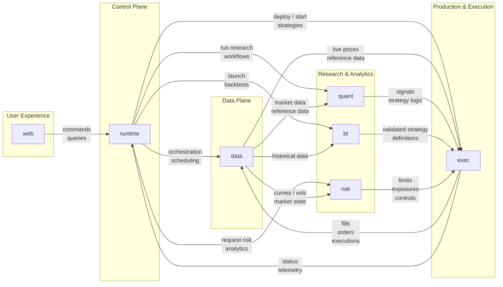

# Helix

Helix is a modular, end-to-end quantitative trading system designed to support the full lifecycle of systematic investment strategies, from research and backtesting to live execution and real-time risk monitoring. It provides a unified environment where users can explore market data, design and validate trading strategies, simulate performance under historical conditions, and deploy those strategies into production with full transparency over P&L, exposures, and operational state.

Helix is structured around clearly separated functional components that interact through well-defined interfaces. The data plane ingests and normalizes market and reference data, making it consistently available across the platform. On top of this, the research and analytics layer enables the development of signals, factors, portfolio construction logic, backtests, and risk views. The execution layer manages order generation, broker connectivity, live strategy operation, and fill tracking. The runtime layer acts as the central orchestration boundary: it accepts commands and queries from the web application, schedules and coordinates workflows, and routes requests across the rest of the platform.

The web application serves as the primary user-facing entry point for monitoring markets, strategies, risk, and system health, while also providing the interface for launching workflows and issuing operational commands. Although the shared `core` package remains part of the repository as a reusable code foundation for domain models, schemas, and utilities, the main operational architecture is centered on `runtime` as the control plane rather than `core` as an explicit platform layer.

Overall, Helix is designed to mirror the architecture of institutional trading platforms, emphasizing separation of concerns, reproducibility between research and production, and a clean distinction between user interaction, orchestration, data flow, computation, and execution. This enables rapid iteration in research while maintaining robustness, auditability, and scalability in live trading environments.

## Platform Architecture



## Component Stack

| Component | Description                                                                                                                                          | Technologies                                                                                                                                                                                             | Notes                                                                                     |
| --------- | ---------------------------------------------------------------------------------------------------------------------------------------------------- | -------------------------------------------------------------------------------------------------------------------------------------------------------------------------------------------------------- | ----------------------------------------------------------------------------------------- |
| `web`     | User-facing application for market data, strategies, backtests, P&L, risk, monitoring, and operational workflows                                     | Next.js, React, TypeScript, Tailwind CSS, TanStack Query, AG Grid / React Table, Recharts                                                                                                                | UI and application boundary for user interaction                                          |
| `runtime` | Central control-plane service that accepts commands and queries, schedules jobs, orchestrates workflows, and serves responses to the web application | Python: FastAPI, Pydantic, APScheduler/Celery patterns. .NET: ASP.NET Core, hosted services, Quartz.NET, EF Core, Dapper. Java: Spring Boot, Spring Scheduler / Quartz, Hibernate (JPA), Spring Data JPA | Orchestrator, scheduler, and system entry point                                           |
| `data`    | Ingests, normalizes, stores, and serves market and reference data                                                                                    | kdb+/q, PostgreSQL, Redis, Parquet, DuckDB                                                                                                                                                               | kdb+ for time-series; PostgreSQL for relational; Redis cache; Parquet/DuckDB for research |
| `quant`   | Research layer for signals, factors, and strategy logic                                                                                              | Python, NumPy, pandas, SciPy, statsmodels, scikit-learn, Jupyter, optional PyKX                                                                                                                          | Primary research environment; optional q for time-series analytics                        |
| `bt`      | Backtesting engine simulating historical strategy performance                                                                                        | Python, pandas, NumPy, Numba, Parquet/DuckDB                                                                                                                                                             | Aligned with quant layer; supports simulation and cost models                             |
| `risk`    | Computes P&L, exposures, attribution, and risk metrics                                                                                               | Python, NumPy, pandas, optional Numba, optional PyKX                                                                                                                                                     | Python for logic; optional q for large-scale aggregation                                  |
| `exec`    | Executes strategies live, manages orders, and tracks fills                                                                                           | Python, RabbitMQ, Kafka, APScheduler/Celery patterns, broker adapters                                                                                                                                    | RabbitMQ for tasks; Kafka for events and audit                                            |
| `core`    | Shared internal package for domain models, schemas, enums, and reusable utilities                                                                    | Python package, dataclasses, Pydantic, typing                                                                                                                                                            | Repository-level shared code foundation, not a separate runtime layer                     |

## Planned Components

- `web`: user-facing application for market data, strategies, backtests, P&L, risk, monitoring, and operational workflows.
- `runtime`: central control-plane service for commands, queries, orchestration, scheduling, and workflow coordination.
- `data`: ingestion, normalization, storage, and serving of market and reference data.
- `quant`: research layer for signal generation, factor models, and portfolio construction logic.
- `bt`: backtesting engine for historical simulation with transaction cost and execution assumptions.
- `risk`: shared analytics for P&L, exposures, attribution, and portfolio risk.
- `exec`: live execution layer for orders, broker connectivity, fills, and runtime strategy operation.
- `core`: shared internal package for schemas, primitives, enums, and reusable utilities.

## Repository Structure

```text
helix/
├── bt/
├── data/
├── exec/
├── quant/
├── risk/
├── runtime/
└── web/
```
