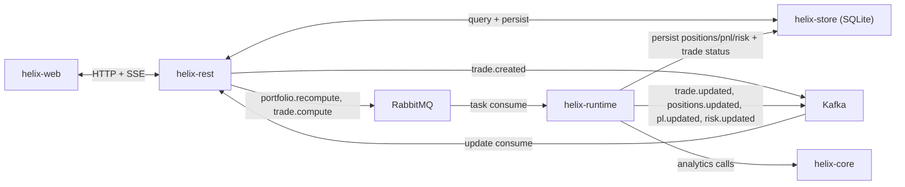

# Helix

Helix is an event-driven portfolio dashboard prototype with:

- `helix-web` (Next.js + AG Grid)
- `helix-rest` (.NET 10 minimal API)
- `helix-runtime` (Python RabbitMQ worker)
- `helix-core` (Python analytics library)
- `helix-store` (SQLite schema + seed tooling)

This README documents the **current implementation**, not an aspirational target.

---

## 1) Current Architecture



### Messaging intent

- **RabbitMQ is the execution trigger** for compute work.
- **Kafka is audit/update stream** for state-change notifications.
- Runtime service (`run-service`) consumes RabbitMQ only.
- Runtime Kafka consumer exists for observability/tooling, not primary execution.

---

## 2) Trade Save Workflow (Current)

When you press **Save** in New Trade / Amend Trade:

1. `helix-web` calls `POST /api/trades` or `PUT /api/trades/{tradeId}`.
2. `helix-rest` validates portfolio/instrument/book and persists trade with status `accepted`.
3. `helix-rest` publishes Kafka `trade.created`.
4. `helix-rest` publishes RabbitMQ tasks:
   - `portfolio.recompute`
   - `trade.compute`
5. `helix-rest` returns immediate accepted response.
6. `helix-runtime` consumes `portfolio.recompute`, runs positions -> P&L -> risk in `helix-core`, persists snapshots, publishes:
   - `positions.updated`
   - `pl.updated`
   - `risk.updated`
7. `helix-runtime` consumes `trade.compute`, computes `notional = quantity * price`, updates trade row, publishes:
   - `trade.updated`
8. `helix-rest` Kafka update consumer receives updates and broadcasts SSE on `/api/events`.
9. `helix-web` listens SSE and refetches portfolio/trades/pnl/risk/market-data.

---

## 3) Implemented REST API

Base URL default: `http://localhost:5057`

### System

- `GET /health`
- `GET /api/events?portfolioId=...` (SSE)
- `GET /swagger` and `GET /swagger/index.html`

### Portfolio

- `GET /api/portfolios` (ordered by DB `sort_order`)
- `GET /api/portfolio?portfolioId=...&asOf=...`
- `POST /api/portfolios/{portfolioId}/recompute`

### Trades

- `GET /api/trades?portfolioId=...&status=...&from=...&to=...`
- `GET /api/trade-form-options`
- `POST /api/trades`
- `PUT /api/trades/{tradeId}`

### Analytics / Market

- `GET /api/pnl?portfolioId=...&asOf=...`
- `GET /api/risk?portfolioId=...&asOf=...`
- `GET /api/market-data`

---

## 4) Broker Names (Current)

### RabbitMQ queues

- `portfolio.recompute`
- `trade.compute`

### Kafka topics actively used

- `trade.created`
- `trade.updated`
- `positions.updated`
- `pl.updated`
- `risk.updated`

Additional topic names are defined in code (`trade.amended`, `trade.cancelled`, `marketdata.updated`, `alert.created`) but are not central to the current end-to-end flow.

---

## 5) Database Schema (Current)

SQLite DB path default: `helix-store/helix.db`

Tables:

- `portfolio`
- `instrument`
- `book`
- `trades`
- `position`
- `market_data`
- `pnl`
- `risk`
- `audit`

Notes:

- Web uses API only (no local mock files).
- Portfolio order is controlled in DB (`portfolio.sort_order`), not hardcoded in web.
- Trade IDs/position IDs are server-generated in REST.
- Positions are netted to one row per instrument (per portfolio/as-of snapshot).

---

## 6) Analytics Model (Current)

Implemented in `helix-core/src/helix_core/analytics.py`:

- Position reconstruction: average-cost inventory model.
- Realized P&L: realized on opposing trades against average cost.
- Unrealized P&L per position:
  - `signed_quantity * (market_price - average_cost)`
- Trade notional:
  - `quantity * price`
- Risk snapshot:
  - `delta`, `gamma`, `var_95` (stress loss removed).

Market data is currently USD-oriented and pulled from `market_data` table.

---

## 7) UI Behavior (Current)

- Portfolio sidebar is fixed.
- Recompute icon is enabled only for currently selected portfolio.
- Cards are collapsible via `+ / -` button.
- Default collapsed state:
  - Summary open
  - Trades/Position/Market Data collapsed
- AG Grid pagination:
  - Trades: 20 rows/page
  - Positions: 10 rows/page
  - Market Data: 20 rows/page
- Trades table uses single-row selection for amend mode.
- Fit Data autosize runs on table data refresh.
- SSE updates trigger refetch and redraw.

---

## 8) Local Setup

### Prerequisites

- .NET SDK **10.x** (required by `net10.0` projects)
- Python 3.11+
- Node.js + npm
- Java (for Kafka UI)
- Homebrew + `kafka` + `rabbitmq` (for provided broker scripts)

### One-time setup

```bash
# Optional: create venvs and Jupyter kernels (Helix Core / Helix Runtime)
./scripts/linux/python_kernels_setup.sh
```

### Clean start (Linux/macOS scripts)

From repo root:

```bash
# 1) Start brokers + Kafka UI
./scripts/linux/brokers_start.sh
```

In a new terminal:

```bash
# 2) Initialize clean DB state (schema + PF-EQ/PF-FI/PF-CM + instruments/books + market data)
python3 helix-store/init_clean_state.py
```

In separate terminals:

```bash
# 3) Runtime worker
./scripts/linux/runtime_start.sh

# 4) REST API
./scripts/linux/rest_start_dev.sh

# 5) Web UI
./scripts/linux/web_start_dev.sh
```

### Default URLs

- Web: `http://localhost:3000`
- REST + Swagger: `http://localhost:5057/swagger`
- RabbitMQ UI: `http://localhost:15672`
- Kafka UI: `http://localhost:8080`

---

## 9) Useful Scripts

### Linux

- `scripts/linux/brokers_start.sh`
- `scripts/linux/brokers_stop.sh`
- `scripts/linux/brokers_clean.sh`
- `scripts/linux/runtime_start.sh`
- `scripts/linux/runtime_replay_trades.sh`
- `scripts/linux/rest_start_dev.sh`
- `scripts/linux/web_start_dev.sh`

### Windows / PowerShell

- `scripts/win/brokers_start.ps1`
- `scripts/win/brokers_stop.ps1`
- `scripts/win/brokers_clean.ps1`
- `scripts/win/runtime_start.ps1`
- `scripts/win/rest_start_dev.ps1`
- `scripts/win/web_start_dev.ps1`

---

## 10) Validation Commands

```bash
# Web lint
cd helix-web && npm run lint

# REST build/test (.NET 10)
cd helix-rest && dotnet build helix.sln
cd helix-rest && dotnet test helix.sln

# Core tests
cd helix-core && pytest
```

Solution file location:

- `helix-rest/helix.sln`

---

## 11) Environment Variables (Main)

Set in `scripts/linux/env.sh` / `scripts/win/env.ps1`:

- `HELIX_DB_PATH`
- `ASPNETCORE_URLS`
- `ASPNETCORE_ENVIRONMENT`
- `HELIX_WEB_URL`
- `HELIX_WEB_PORT`
- `HELIX_KAFKA_BOOTSTRAP_SERVERS`
- `HELIX_RABBITMQ_HOST`
- `HELIX_RABBITMQ_PORT`
- `HELIX_RABBITMQ_QUEUE_PORTFOLIO_RECOMPUTE`
- `HELIX_RABBITMQ_QUEUE_TRADE_COMPUTE`
- `HELIX_RABBITMQ_MANAGEMENT_URL`
- `HELIX_KAFKA_UI_URL`

---

## 12) Troubleshooting

### `NETSDK1045` (.NET 10 target not supported)

Install .NET SDK 10.x and ensure `dotnet --list-sdks` includes 10.

### Kafka `Connection refused` / broker down

Start brokers first (`./scripts/linux/brokers_start.sh`) and confirm Kafka is on `localhost:9092`.

### REST Kafka update consumer warnings about missing topics

REST now creates update topics on startup and ignores `TopicAlreadyExists`. If this still appears, rebuild and restart REST on latest code.

### Runtime thread `rabbitmq-worker stopped unexpectedly`

RabbitMQ is unreachable or worker hit an unhandled exception. Check:

- RabbitMQ service/UI running
- queue names match env vars
- runtime logs for specific task failure

### Trade accepted but no positions/P&L/risk update

Check:

1. runtime process is running
2. RabbitMQ queues have/consume tasks
3. market data exists for traded instrument in `market_data`
4. Kafka topics `positions.updated/pl.updated/risk.updated/trade.updated` receive events

---

## 13) Repo Structure

```text
helix-core/      # Analytics primitives
helix-runtime/   # RabbitMQ worker + Kafka update publisher
helix-rest/      # .NET 10 API + SSE broadcaster + broker publishers/consumers
helix-store/     # SQLite schema + seed/reset scripts
helix-web/       # Next.js dashboard
scripts/         # Linux + PowerShell helpers
```
