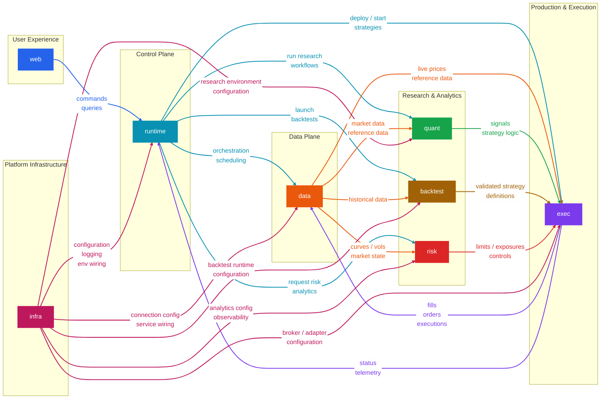

# Helix

Helix is a modular, end-to-end quantitative trading system designed to support the full lifecycle of systematic investment strategies, from research and backtesting to live execution and real-time risk monitoring. It provides a unified environment where users can explore market data, design and validate trading strategies, simulate performance under historical conditions, and deploy those strategies into production with full transparency over P&L, exposures, and operational state.

Helix is structured around clearly separated functional components that interact through well-defined interfaces. The data plane ingests and normalizes market and reference data, making it consistently available across the platform. On top of this, the research and analytics layer enables the development of signals, factors, portfolio construction logic, backtests, and risk views. The execution layer manages order generation, broker connectivity, live strategy operation, and fill tracking. The runtime layer acts as the central orchestration boundary: it accepts commands and queries from the web application, schedules and coordinates workflows, and routes requests across the rest of the platform.

The web application serves as the primary user-facing entry point for monitoring markets, strategies, risk, and system health, while also providing the interface for launching workflows and issuing operational commands. The shared `infra` package provides platform-wide operational infrastructure such as connection strings, environment-variable loading, logging rules, configuration wiring, and related service bootstrapping concerns. The main operational architecture remains centered on `runtime` as the control plane, while `infra` standardizes how the rest of the platform is configured and connected.

Overall, Helix is designed to mirror the architecture of institutional trading platforms, emphasizing separation of concerns, reproducibility between research and production, and a clean distinction between user interaction, orchestration, data flow, computation, and execution. This enables rapid iteration in research while maintaining robustness, auditability, and scalability in live trading environments.

## Platform Architecture



## Planned Components

- `web`: user-facing application for market data, strategies, backtests, P&L, risk, monitoring, and operational workflows.
- `runtime`: central control-plane service for commands, queries, orchestration, scheduling, and workflow coordination.
- `data`: ingestion, normalization, storage, and serving of market and reference data.
- `quant`: research layer for signal generation, factor models, and portfolio construction logic.
- `backtest`: backtesting engine for historical simulation with transaction cost and execution assumptions.
- `risk`: shared analytics for P&L, exposures, attribution, and portfolio risk.
- `exec`: live execution layer for orders, broker connectivity, fills, and runtime strategy operation.
- `infra`: shared infrastructure package for environment loading, connection configuration, logging policy, secrets, and service wiring.

## Component Stack

| Component  | Description                                                                                                                                          | Technologies                                                                                                                                                                                             | Notes                                                                                     |
| ---------- | ---------------------------------------------------------------------------------------------------------------------------------------------------- | -------------------------------------------------------------------------------------------------------------------------------------------------------------------------------------------------------- | ----------------------------------------------------------------------------------------- |
| `web`      | User-facing application for market data, strategies, backtests, P&L, risk, monitoring, and operational workflows                                     | Next.js, React, TypeScript, Tailwind CSS, TanStack Query, AG Grid / React Table, Recharts                                                                                                                | UI and application boundary for user interaction                                          |
| `runtime`  | Central control-plane service that accepts commands and queries, schedules jobs, orchestrates workflows, and serves responses to the web application | Python: FastAPI, Pydantic, APScheduler/Celery patterns. .NET: ASP.NET Core, hosted services, Quartz.NET, EF Core, Dapper. Java: Spring Boot, Spring Scheduler / Quartz, Hibernate (JPA), Spring Data JPA | Orchestrator, scheduler, and system entry point                                           |
| `data`     | Ingests, normalizes, stores, and serves market and reference data                                                                                    | kdb+/q, PostgreSQL, Redis, Parquet, DuckDB                                                                                                                                                               | kdb+ for time-series; PostgreSQL for relational; Redis cache; Parquet/DuckDB for research |
| `quant`    | Research layer for signals, factors, and strategy logic                                                                                              | Python, NumPy, pandas, SciPy, statsmodels, scikit-learn, Jupyter, optional PyKX                                                                                                                          | Primary research environment; optional q for time-series analytics                        |
| `backtest` | Backtesting engine simulating historical strategy performance                                                                                        | Python, pandas, NumPy, Numba, Parquet/DuckDB                                                                                                                                                             | Aligned with quant layer; supports simulation and cost models                             |
| `risk`     | Computes P&L, exposures, attribution, and risk metrics                                                                                               | Python, NumPy, pandas, optional Numba, optional PyKX                                                                                                                                                     | Python for logic; optional q for large-scale aggregation                                  |
| `exec`     | Executes strategies live, manages orders, and tracks fills                                                                                           | Python, RabbitMQ, Kafka, APScheduler/Celery patterns, broker adapters                                                                                                                                    | RabbitMQ for tasks; Kafka for events and audit                                            |
| `infra`    | Shared infrastructure package for connection strings, environment-variable loading, logging rules, configuration, and platform wiring                | Python package, Pydantic settings, structured logging, secrets/config adapters, dependency injection / service registration patterns                                                                     | Cross-cutting operational infrastructure, not a business-domain layer                     |

## Production Deployment

| Component  | Production form                           | How to deploy                                                                                                                                                                                                        | Recommended vendors / technologies                                                           |
| ---------- | ----------------------------------------- | -------------------------------------------------------------------------------------------------------------------------------------------------------------------------------------------------------------------- | -------------------------------------------------------------------------------------------- |
| `web`      | Stateless container                       | Build static frontend assets, serve via Nginx or lightweight server, run 2+ replicas behind ingress/load balancer. No local state.                                                                                   | Nginx / Vercel / AWS CloudFront + S3                                                         |
| `runtime`  | Stateless API/orchestrator container      | Central service. Multiple replicas, internal exposure, autoscaling first. Handles all orchestration and API calls.                                                                                                   | .NET (ASP.NET Core) / Java (Spring Boot) / FastAPI (Python)                                  |
| `data`     | Stateful service                          | Split into ingestion workers + storage layer. Workers containerized; storage managed separately, not disposable.                                                                                                     | PostgreSQL (AWS RDS / GCP Cloud SQL) / kdb+ / Snowflake                                      |
| `quant`    | Library + worker image                    | Versioned Python packages, executed via worker containers for reproducibility.                                                                                                                                       | Python (NumPy/Pandas) / kdb+ (q) / PySpark                                                   |
| `backtest` | Batch / ephemeral job container           | Run as Kubernetes Jobs. Each run isolated, reproducible, resource-bounded.                                                                                                                                           | Kubernetes Jobs / Argo Workflows / AWS Batch                                                 |
| `risk`     | Service + jobs                            | Lightweight API for live risk + background jobs for heavy recomputation.                                                                                                                                             | Python (FastAPI) / .NET / Spark (for large-scale risk)                                       |
| `exec`     | Long-running service                      | Hardened internal service. Strict network policies, audit logging, retries, secrets management.                                                                                                                      | Java (Spring Boot) / .NET / FIX engines (QuickFIX/J, QuickFIX/n)                             |
| `infra`    | Shared library + deployment configuration | Not deployed as a standalone service. Versioned package plus shared config, env policy, logging rules, secrets wiring, and bootstrap conventions consumed by runtime, data workers, quant, backtest, risk, and exec. | Pydantic Settings / dotenv / Vault / AWS Secrets Manager / Kubernetes ConfigMaps and Secrets |

## Repository Structure

```text
helix/
├── web/
├── runtime/
├── data/
├── quant/
├── backtest/
├── risk/
├── exec/
└── infra/
```

## Updates

- `2026-04-04 20:08:43 BST`:
  Expanded the `web` dashboard with reusable base components and concrete cards for Firm Wide P&L, P&L Summary and Risk, Trades, and P&L Trend. Added mocked datasets across the dashboard, including a seeded 50-row trades dataset and a denser P&L trend series with more clearly separated lines. Ported the AG Grid trades experience into the Helix app with filtering, pagination, fit-to-header, fit-to-data, CSV export, selection controls, keyboard copy support, paste-to-filter behavior, and auto-height rendering, then tuned it to show 15 rows per page without the internal vertical scrollbar. Normalized dashboard structure and presentation in `web`, including the `base/` and `cards/` split, Helix naming cleanup for legacy header tokens, wider large-screen layout, larger Firm Wide P&L emphasis, and chart readability improvements such as more data points, stronger line separation, larger axis labels, and increased chart height.
- `2026-04-04 20:32:01 BST`:
  Continued the `web` dashboard refactor by renaming the concrete card files and exports to the shorter `pnl`, `trend`, `risk`, `market`, `position`, and `trades` scheme. Added Helix-native `Market` and `Position` cards using the shared dashboard shell and AG Grid helpers, expanded the mocked market and position datasets, removed header timestamps from `Pnl`, `Trend`, `Risk`, and `Market`, moved collapsed summary values for `Trend` and `Risk` to the right side of the header, and tuned `Market` to render 20 visible rows without an internal vertical scrollbar.
