# Helix

Helix is a front-office portfolio analytics platform that delivers real-time positions, P&L, and risk by combining a web interface, a REST orchestration layer, a core analytics engine, and an asynchronous runtime for event-driven processing. It supports full trading workflows, including trade capture, market data updates, and staged asynchronous analytics recomputation, while keeping persistent state in SQLite and using Kafka plus RabbitMQ for event distribution and background work. The platform is structured so that web, orchestration, analytics, runtime, and storage concerns remain separate and inspectable.

---

## Package Map

- `helix-web` (Next.js + AG Grid)
- `helix-rest` (.NET 10 minimal API)
- `helix-runtime` (Python RabbitMQ worker)
- `helix-core` (Python analytics library)
- `helix-store` (SQLite schema + seed tooling)

---

## Installation

Prerequisites:

- Python `3.11+`
- Node.js + `npm`
- .NET SDK `10.0.201`
- Java
- Homebrew with `kafka` and `rabbitmq`

Linux / macOS:

```bash
./scripts/linux/install.sh
```

Windows / PowerShell:

```powershell
./scripts/win/install.ps1
```

What the install scripts do:

- restore `.NET` packages for `helix-rest`
- install `helix-web` npm dependencies
- create Python virtual environments for `helix-core` and `helix-runtime`
- install `helix-core` and `helix-runtime` into the runtime environment
- ensure Kafka, RabbitMQ, and OpenJDK are installed when Homebrew is available

---

## Flow

## 

Typical live flow:

1. A trade is created, amended, or deleted through `helix-web`.
2. `helix-rest` validates and persists the trade in SQLite.
3. `helix-rest` publishes:
   - Kafka trade events such as `trade.created`, `trade.updated`, or `trade.deleted`
   - RabbitMQ tasks such as `trade.compute` and `position.pl.compute`
4. `helix-runtime` consumes `trade.compute`, enriches trade notional/state, then consumes `position.pl.compute` to rebuild instrument positions and position-level P&L through `helix-core`.
5. `helix-runtime` persists fresh `position` snapshots with row-level `realized_pnl`, `unrealized_pnl`, and `total_pnl`, then queues `portfolio.pl.compute` and `portfolio.risk.compute`.
6. `helix-runtime` computes and persists portfolio-level `pnl` and `risk` snapshots from those position snapshots.
7. `helix-runtime` publishes Kafka updates:
   - `position.updated`
   - `position.pl.updated`
   - `portfolio.pl.updated`
   - `portfolio.risk.updated`
   - `trade.updated`
8. `helix-rest` consumes those Kafka updates and rebroadcasts them over server-sent events.
9. `helix-web` listens to SSE and refreshes the visible portfolio state, including the filtered market data view for currently held positions.

---

## Components

### helix-web (next.js)

`helix-web` is the operator-facing UI. It renders portfolios, trades, positions, market data, P&L, and risk using Next.js and AG Grid. It talks directly to `helix-rest`, opens an SSE stream for live refresh, and keeps dashboard-level state in the browser.

Primary responsibilities:

- trade entry, amendment, and deletion
- portfolio dashboard and market data views
- position rows with realized, unrealized, and total P&L contribution
- live refresh from REST SSE events
- client-side grid interaction and filtering

### helix-rest (asp\.net | ef.core )

`helix-rest` is the orchestration and integration layer. It exposes the HTTP API, persists trades and reference data with EF Core, reads snapshot data from SQLite, publishes Kafka and RabbitMQ messages, and rebroadcasts platform updates to the web tier over SSE.

Primary responsibilities:

- REST endpoints for portfolios, trades, market data, P&L, and risk
- SQLite persistence and snapshot reads
- Kafka trade/update publication and consumption
- RabbitMQ task publication
- SSE fan-out to the UI

### helix-runtime (python)

`helix-runtime` is the asynchronous worker service. It consumes RabbitMQ tasks, rebuilds portfolio analytics from current persisted state, writes fresh snapshots, and emits Kafka update events after successful persistence.

Primary responsibilities:

- consume `trade.compute`, `position.pl.compute`, `portfolio.pl.compute`, and `portfolio.risk.compute`
- load trades and market inputs from SQLite
- invoke `helix-core`
- persist `position`, `pnl`, and `risk`
- stage analytics so position reconstruction happens before portfolio P&L and portfolio risk
- publish Kafka update events

### helix-core (python)

`helix-core` is the analytics library. It contains the domain models and the actual calculation logic for trades, positions, valuation, portfolio analytics, and risk. Valuation and risk are both model-based extension points.

Current analytics structure:

- `trades`
- `positions`
- `portfolio`
- `valuation`
- `risk`
- `market`

Current built-in models:

- P&L / inventory:
  - `average_cost`
  - `fifo`
  - `lifo`
- risk:
  - `standard`

Current standard risk output:

- `delta`
- `gross_exposure`
- `net_exposure`
- `var_95`

### helix-store (sqlLite db)

`helix-store` owns the persistent schema, seed data, and local reset tooling. It stores reference data, trades, position snapshots, P&L snapshots, risk snapshots, and audit rows in SQLite.

Core tables:

- `portfolio`
- `instrument`
- `book`
- `trades`
- `position`
- `market_data`
- `pnl`
- `risk`
- `audit`

Snapshot details:

- `position` stores live instrument positions plus row-level `realized_pnl`, `unrealized_pnl`, and `total_pnl`
- `pnl` stores portfolio-level `total_pnl`, `realized_pnl`, and `unrealized_pnl`
- `risk` stores `delta`, `gross_exposure`, `net_exposure`, and `var_95`

Reset and seed tooling:

- [`helix-store/init_clean_state.py`](/Users/alexandershubert/git/helix/helix-store/init_clean_state.py)
- [`scripts/linux/store_init_clean_state.sh`](/Users/alexandershubert/git/helix/scripts/linux/store_init_clean_state.sh)
- [`scripts/win/store_init_clean_state.ps1`](/Users/alexandershubert/git/helix/scripts/win/store_init_clean_state.ps1)

---

## Launch

Linux / macOS:

```bash
./scripts/linux/launch.sh
```

Windows / PowerShell:

```powershell
./scripts/win/launch.ps1
```

What the launch scripts do:

- start Kafka and RabbitMQ
- reset the SQLite store to clean seeded state
- build and publish `helix-rest` in `Release`
- build the `helix-web` production bundle
- start `helix-rest` from the published production output
- start `helix-runtime`
- start `helix-web` with the production server
- write process logs under `.helix/logs`

Stop the full stack:

Linux / macOS:

```bash
./scripts/linux/stop.sh
```

Windows / PowerShell:

```powershell
./scripts/win/stop.ps1
```

Default URLs:

- REST API: `http://localhost:5057`
- Web UI: `http://localhost:3000`
- RabbitMQ UI: `http://localhost:15672`
- Kafka UI: `http://localhost:8080`
